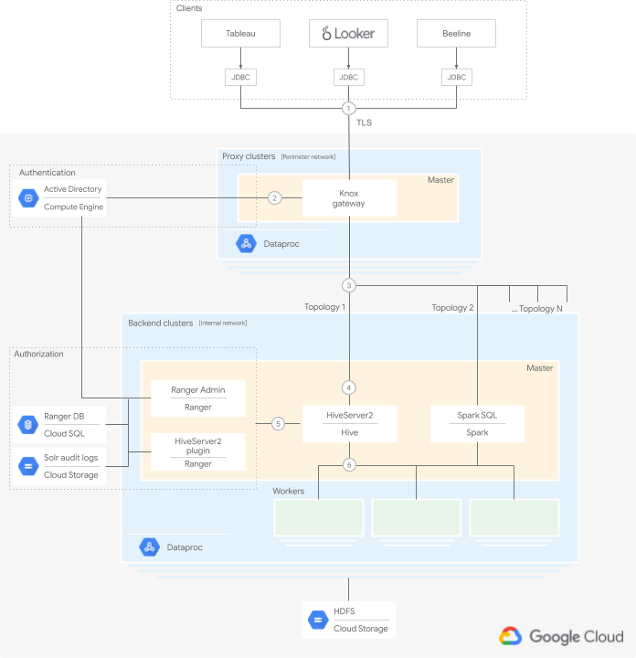

 

  <h2 align="center">Connecting your Visualization Software to Hadoop on Google Cloud</h2>
  

  

    Companion configuration and scripts to set up your infrastructure
     
    <a href="https://cloud.google.com/solutions/migration/hadoop/architecture-for-connecting-visualization-software-to-hadoop-on-google-cloud">Architecture</a>
    ·
    <a href="https://cloud.google.com/solutions/migration/hadoop/connecting-visualization-software-to-hadoop-on-google-cloud">Hands-on</a>
    ·
    <a href="terraform/README.md">Terraform configuration</a>
    ·
    <a href="shell/README.md">Shell scripts</a>
  

## Table of Contents

- [Table of Contents](#table-of-contents)
- [Overview](#overview)
- [Objectives](#objectives)
- [Costs](#costs)
- [Usage](#usage)
- [Licensing](#licensing)
- [Contributing](#contributing)

## Overview

This repository is a companion to a pair of articles that help you build an end-to-end solution to enable data analysts secure access to data using business intelligence (BI) tools. The solution uses familiar open source tools from the Hadoop ecosystem and Tableau as the BI tool.

  

* In the [first part][first-part], you focused on the architecture definition, its components, and their interactions. Click on the diagram above for more information. 
* In the [second part][second-part] you step through the process of setting up the components from the architecture that makes up the end-to-end Hive topology on Google Cloud.

This repository contains:
 * [Shell scripts][shell-scripts]: to support the [step-by-step tutorial from part two][second-part]. Best suited as a learning exercise.
 * [Terraform configuration][terraform-configuration]: to automatically set up the majority of the infrastructure. Best suited to quickly stand up a working prototype.

This repository is intended for operators and IT administrators who are interested in setting up secure data access for data analysts using BI tools such as Tableau and Looker

## Objectives

* Create an end-to end setup that allows a BI tool to use data from a Hadoop environment.
* Authenticate and authorize user requests.
* Set up and use secure communication channels between the BI tool and the cluster.

## Costs

The configuration and scripts in this repository use billable components of Google Cloud, including:
* [Dataproc][dataproc-pricing]
* [Cloud SQL][cloud-sql-pricing]
* [Cloud Storage][cloud-storage-pricing]
* [Network egress][network-egress-pricing]

## Usage

* **Hands-on**   For a step-by-step tutorial to set up the architecture, follow the instructions in [part two of the series][second-part], and use the [shell scripts][shell-scripts] provided in this repository.
  
* **Automated**  For an automated way of setting up the architecture, follow the instructions provided along with the [Terraform configuration][terraform-configuration] in this repository.
  
## Licensing

    Copyright 2020 Google LLC

    Licensed under the Apache License, Version 2.0 (the "License");
    you may not use this file except in compliance with the License.
    You may obtain a copy of the License at

        https://www.apache.org/licenses/LICENSE-2.0

    Unless required by applicable law or agreed to in writing, software
    distributed under the License is distributed on an "AS IS" BASIS,
    WITHOUT WARRANTIES OR CONDITIONS OF ANY KIND, either express or implied.
    See the License for the specific language governing permissions and
    limitations under the License.

## Contributing

* [Contributing guidelines][contributing-guidelines]
* [Code of conduct][code-of-conduct]

<!-- LINKS: https://www.markdownguide.org/basic-syntax/#reference-style-links -->
[first-part]: https://cloud.google.com/solutions/migration/hadoop/architecture-for-connecting-visualization-software-to-hadoop-on-google-cloud
[second-part]: https://cloud.google.com/solutions/migration/hadoop/connecting-visualization-software-to-hadoop-on-google-cloud

[dataproc-pricing]: https://cloud.google.com/dataproc/pricing?hl=bg
[cloud-sql-pricing]: https://cloud.google.com/sql/pricing
[cloud-storage-pricing]: https://cloud.google.com/storage/pricing
[network-egress-pricing]: https://cloud.google.com/compute/network-pricing

[shell-scripts]: shell/README.md
[terraform-configuration]: terraform/README.md

[contributing-guidelines]: docs/contributing.md
[code-of-conduct]: docs/code-of-conduct.md
