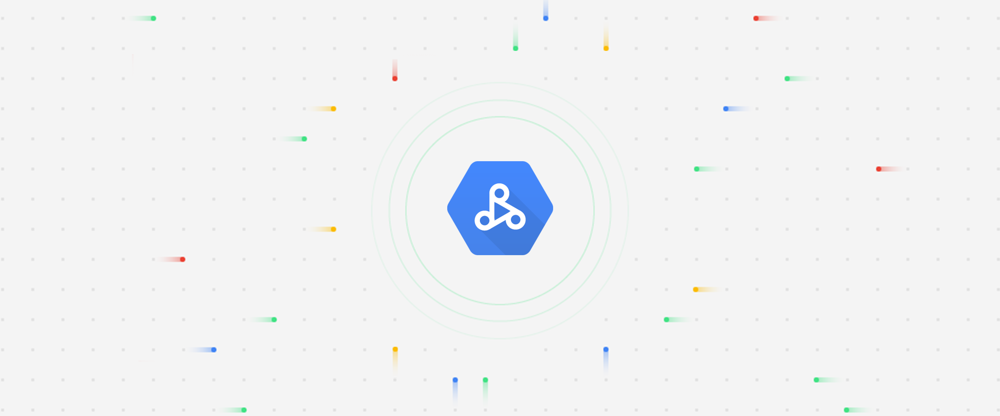

<!-- Readme based on https://github.com/othneildrew/Best-README-Template -->

<br />
<p align="center">
  <h2 align="center">Connecting your Visualization Software to Hadoop on Google Cloud</h2>
  

  <p align="center">
    Companion Terraform configuration to set up your infrastructure automatically
    <br />
    <a href="https://cloud.google.com/solutions/migration/hadoop/architecture-for-connecting-visualization-software-to-hadoop-on-google-cloud">Architecture</a>
    ·
    <a href="https://cloud.google.com/solutions/migration/hadoop/connecting-visualization-software-to-hadoop-on-google-cloud">Hands-on</a>
    ·
    <a href="../README.md">Repo home</a>
    ·
    <a href="../shell/README.md">Shell scripts</a>
  </p>
</p>

## Table of Contents

- [Table of Contents](#table-of-contents)
- [Before you begin](#before-you-begin)
  - [Set up the project](#set-up-the-project)
  - [Set up a service account](#set-up-a-service-account)
- [Create the backend and proxy clusters](#create-the-backend-and-proxy-clusters)
- [Wrap up and continue with tutorial](#wrap-up-and-continue-with-tutorial)

## Before you begin

For an overview of the solution, its objectives and costs, refer to the main [README.md][main-readme].

### Set up the project

1. Open the [Cloud Console][cloud-console]
2. Activate [Cloud Shell][cloud-shell]

At the bottom of the Cloud Console, a [Cloud Shell][cloud-shell-features] session starts and displays a command-line prompt. Cloud Shell is a shell environment with the Cloud SDK already installed, including the [`gcloud` command-line tool][gcloud-cli], and with values already set for your current project. It can take a few seconds for the session to initialize.

3. Choose an ID for a new project. Replace the `<project-id>` placeholder and run the following command:

```sh
  export PROJECT_ID=<project-id>
```

4. Create the new project to organize the Google Cloud resources that you will create.

```sh
  gcloud projects create ${PROJECT_ID}
```

5. Set the project ID in the [Cloud SDK properties][cloud-sdk-properties] 
  
```sh
  gcloud config set project ${PROJECT_ID}
```

6. List the available billing accounts.

```sh
  gcloud alpha billing accounts list
```

If no billing accounts were available, please follow [these instructions][billing-instructions] to set up billing. 

7. Enable billing for the project. Replace the `<billing-account-id>` placeholder by your chosen billing account id.

```sh
  gcloud alpha billing projects link ${PROJECT_ID} \
      --billing-account <billing-account-id>
```

### Set up a service account

1. In Cloud Shell, create a [service account][service-account] that will be used by Terraform to create all the resources in your infrastructure.

```sh
  export SERVICE_ACCOUNT_NAME=terraformer

  gcloud iam service-accounts create ${SERVICE_ACCOUNT_NAME} \
    --project=${PROJECT_ID} \
    --description="Terraformer" \
    --display-name="Terraform Service Account"

  bash -c 'array=( editor resourcemanager.projectIamAdmin )
  for i in "${array[@]}"
  do
    gcloud projects add-iam-policy-binding ${PROJECT_ID} \
      --project=${PROJECT_ID} \
      --member "serviceAccount:${SERVICE_ACCOUNT_NAME}@${PROJECT_ID}.iam.gserviceaccount.com" \
      --role roles/$i
  done'
```

2. Create a service account [key file][key-adc]

```sh
  export GOOGLE_CLOUD_KEYFILE_JSON=~/${PROJECT_ID}-terraformer-key.json

  gcloud iam service-accounts keys create \
     ${GOOGLE_CLOUD_KEYFILE_JSON} \
     --iam-account ${SERVICE_ACCOUNT_NAME}@${PROJECT_ID}.iam.gserviceaccount.com
```   

## Create the backend and proxy clusters

1. In Cloud Shell, clone this repository

<!-- TODO Change the repo link -->
```sh
  git clone git@github.com:davidcueva/dataproc-connect-visualization-05.git
```

2. Change directory into the Terraform root directory.

```sh
  cd dataproc-connect-visualization/terraform
```

3. Set the project ID in the corresponding Terraform environment variable

```sh
  export TF_VAR_project_id=${PROJECT_ID}
```

4. The Terraform configuration uses several other environment variables, all of which have defaults. For any non-trivial use of this solution we strongly recommend changing the default passwords. To change the default values edit the [variables.tf](variables.tf) file.

```sh
  vi variables.tf 
```

<ul> <li style="list-style-type: none;">Save and close the file</li> </ul> 

5. Initialize the Terraform working directory
   
```sh
  terraform init
```

6. Create the infrastructure

```sh
  terraform apply
```

After you confirm the resource plan, Terraform will create and configure all the necessary resources in both the backend and proxy clusters. This process will take around fifteen minutes to complete.

## Wrap up and continue with tutorial

Once Terraform has finished creating the infrastructure perform the following steps to wrap-up the configuration.

1. In Cloud Shell export the following environment variables. The values below are the same as the defaults specified in [variables.tf](variables.tf). Replace them below if you used your own values instead of the defaults to apply the Terraform configuration. 

```sh
  export ZONE=us-central1-b
  export BACKEND_CLUSTER=backend-cluster
  export PROXY_CLUSTER=proxy-cluster
```

Also, take a note of the Ranger admin UI password from [variables.tf](variables.tf). You will use it shortly to access the Ranger UI.

2. Connect to the master node of the backend cluster using SSH.

```sh
  gcloud compute ssh --zone ${ZONE} ${BACKEND_CLUSTER}-m
```

3. In the SSH terminal run the following command to get the internal DNS name of the backend master. You use this name as `<backend-master-internal-dns-name>` to configure the Hive service in Apache Ranger.

```sh
  hostname -A | tr -d '[:space:]'; echo
```

3. Continue the hands-on tutorial starting only from the [**Create Ranger policies section**][create-ranger-policies-section].


<!-- LINKS: https://www.markdownguide.org/basic-syntax/#reference-style-links -->
[cloud-console]: https://console.cloud.google.com/
[cloud-shell]: https://console.cloud.google.com/?cloudshell=true&_ga=2.43377068.820133692.1587377411-71235912.1585654570&_gac=1.118947195.1584696876.Cj0KCQjw09HzBRDrARIsAG60GP9u6OBk_qQ02rkzBXpwpMd6YZ30A2D4gSl2Wwte1CqPW_sY6mH_xbIaAmIgEALw_wcB
[cloud-shell-features]: https://cloud.google.com/shell/docs/features
[gcloud-cli]: https://cloud.google.com/sdk/gcloud

[tf-env-var]: https://www.Terraform.io/docs/configuration/variables.html#environment-variables
[cloud-sdk-properties]: https://cloud.google.com/sdk/docs/properties#setting_properties
[key-adc]: https://cloud.google.com/docs/authentication/production#providing_credentials_to_your_application
[billing-instructions]: https://cloud.google.com/billing/docs/how-to/modify-project

[service-account]: https://docs.google.com/document/d/1rYxu2xBZsDgNo_-Ex4jb_3YxwL6cWab8QzFiY33_qWA/edit#

[create-ranger-policies-section]: https://cloud.google.com/solutions/migration/hadoop/connecting-visualization-software-to-hadoop-on-google-cloud#creating_ranger_policies

[main-readme]: ../README.md